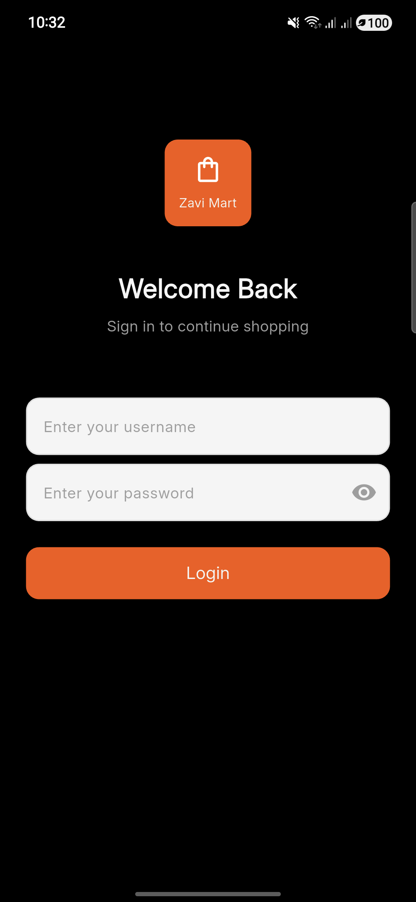
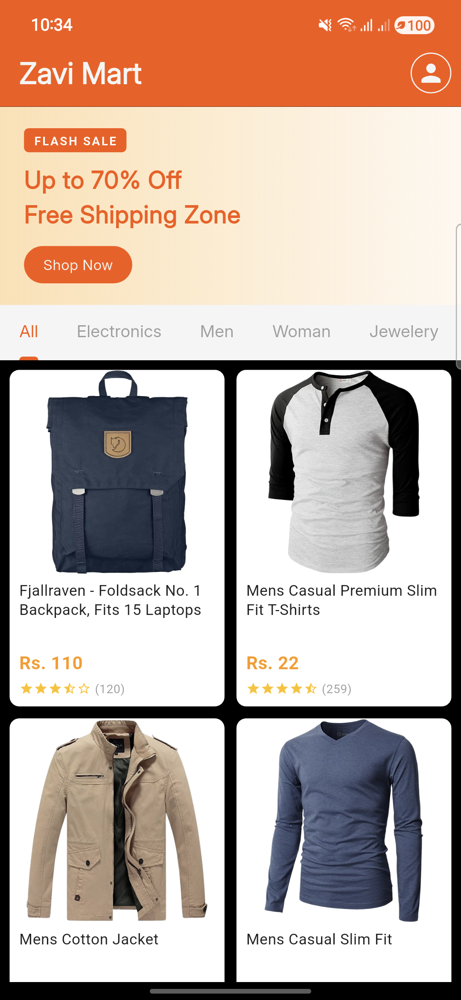

# 🛍️ Zavi Mart

A clean and modern Flutter e-commerce application featuring **product browsing**, **category filtering**, **user authentication**, and **profile management**.\
Built using **Fake Store API**, **GetX**, **Dio**, **Freezed**, and **Shared Preferences**.

---

## 🚀 Features

- 🏠 **Home screen with product grid**
- 🗂️ **Category filtering** (All, Electronics, Fashion)
- 🎯 **Collapsible promo banner with sticky tab bar**
- 🔐 **Login with username and password**
- 👤 **User profile fetched from decoded JWT**
- 🔄 **Pull-to-refresh on product listings**
- 🗂️ **State management with GetX**
- 🔧 **Clean architecture with Freezed models**
- 📦 **Local persistence using SharedPreferences**
- 🌐 **API integration using Dio**

---

## 🛠️ Technologies Used

| Tech | Purpose |
|---|---|
| **Flutter** | UI framework |
| **GetX** | State management, DI, routing |
| **Dio** | Networking |
| **Freezed** | Immutable data models |
| **Shared Preferences** | Local token storage |
| **Fake Store API** | Products, users, auth |

---

## 📦 Project Setup

Follow the steps below to run the project locally.

### 1️⃣ Clone the repository

```sh
git clone https://github.com/your-username/zavi_mart.git
cd zavi_mart
```

---

### 2️⃣ Install FVM

If you don't have FVM installed:

```sh
dart pub global activate fvm
```

Then install and use the project's Flutter version:

```sh
fvm install 3.41.1
fvm use 3.41.1
```

---

### 3️⃣ Install dependencies

Using FVM:
```sh
fvm flutter pub get
```

Without FVM:
```sh
flutter pub get
```

---

### 4️⃣ Generate Freezed & JSON serialization code

Using FVM:
```sh
fvm dart run build_runner build -d
```

Without FVM:
```sh
dart run build_runner build -d
```

> ⚠️ This step is **mandatory**. The app will not compile without the generated `.freezed.dart` and `.g.dart` files.

---

### 5️⃣ Run the project

Using FVM:
```sh
fvm flutter run
```

Without FVM:
```sh
flutter run
```

---

## 📸 Screenshots

<div style="display: flex; gap: 10px;">
  
  
  
</div>

---

## 🧩 Folder Structure

```
lib/
 ├─ src/
 │   ├─ core/
 │   │   ├─ base/              # BaseController, BaseView, BaseRemoteDatasource
 │   │   ├─ config/            # Build config, env setup
 │   │   ├─ constants/         # Colors, strings, values
 │   │   └─ exceptions/        # Custom exception types
 │   ├─ data/
 │   │   ├─ model/             # Freezed models (User, Product, etc.)
 │   │   └─ remote/
 │   │       ├─ auth/          # Auth datasource
 │   │       ├─ home/          # Products datasource
 │   │       └─ profile/       # Profile datasource
 │   ├─ services/
 │   │   └─ auth_service.dart  # Token persistence
 │   └─ module/
 │       ├─ home/
 │       │   ├─ bindings/
 │       │   ├─ controllers/
 │       │   ├─ views/
 │       │   └─ widgets/       # ProductCard, PromoBanner, TabBody, etc.
 │       ├─ profile/
 │       │   ├─ bindings/
 │       │   ├─ controllers/
 │       │   └─ views/
 │       └─ auth/
 │           ├─ bindings/
 │           ├─ controllers/
 │           └─ views/
 └─ main.dart
```

---

## 🏗️ Architecture Notes

### 1. How horizontal swipe (tab switching) was implemented

The home screen uses Flutter's `TabBarView` paired with a `TabController` that lives inside `HomeController` (via `GetTickerProviderStateMixin`). The tab bar is rendered as a `SliverPersistentHeader` inside a `NestedScrollView`, keeping it pinned once the promo banner scrolls out of view. Swiping between tabs is handled natively by `TabBarView` with `PageScrollPhysics`.

### 2. Who owns the vertical scroll and why

The `NestedScrollView` owns the outer vertical scroll (banner collapse + tab bar pinning). Each `TabBody` has its own inner `CustomScrollView` with `AlwaysScrollableScrollPhysics` to support pull-to-refresh even when the product list is short. This split is necessary so the banner and tab bar respond to scroll events independently of the per-tab content.

### 3. Trade-offs and limitations

- **`wantKeepAlive` is not used** — GetX holds the product list reactively, so tabs don't need to preserve widget state. The trade-off is that the scroll position within a tab resets when switching away and back.
- **All tabs share one product list** — filtering is done client-side. This is fine for the Fake Store API's small dataset but wouldn't scale to paginated APIs.
- **`TabController` lifecycle is tied to `HomeController`** — disposing the controller also disposes the tab animation, which is correct but means the controller must not be destroyed while the view is still visible.

---

## 💬 API Reference

Data is fetched from **Fake Store API**:\
https://fakestoreapi.com

| Endpoint | Usage |
|---|---|
| `POST /auth/login` | Get JWT token |
| `GET /products` | Fetch all products |
| `GET /users/{id}` | Fetch user profile |

> The JWT token's `sub` field is decoded client-side to extract the user ID, since the API has no `/users/me` endpoint.

---

### ⭐ If you like this project, don't forget to star the repo!